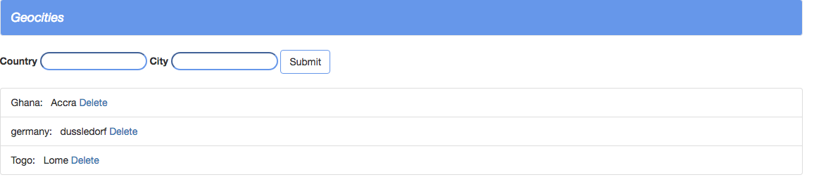

# Geocities

Geocities is a complete Express.js/Mongodb  application that stores data on countries and their cities.

<h2 id="screenshots">Screenshot</h2>




### Version
1.0.0

## Usage


### Installation

Install the dependencies

```sh
$ npm install
```
Run app

```sh
$ npm start
```
OR
```sh
$ nodemon
```


